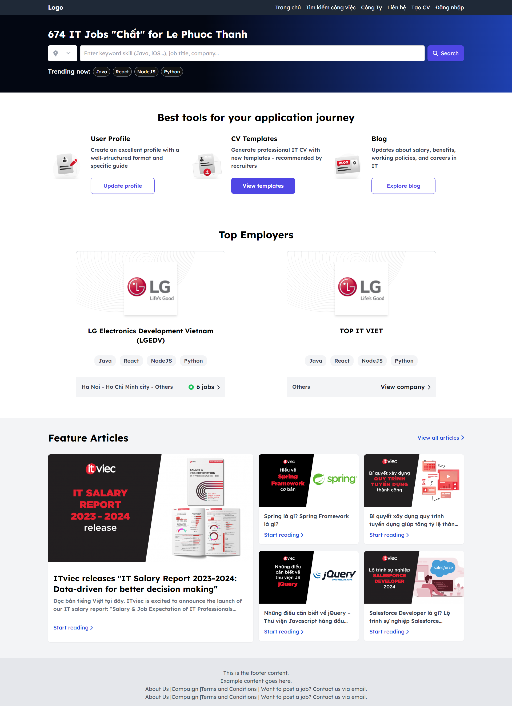
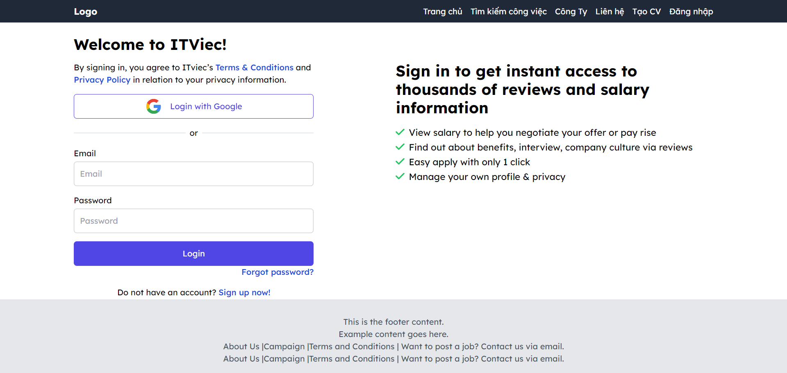
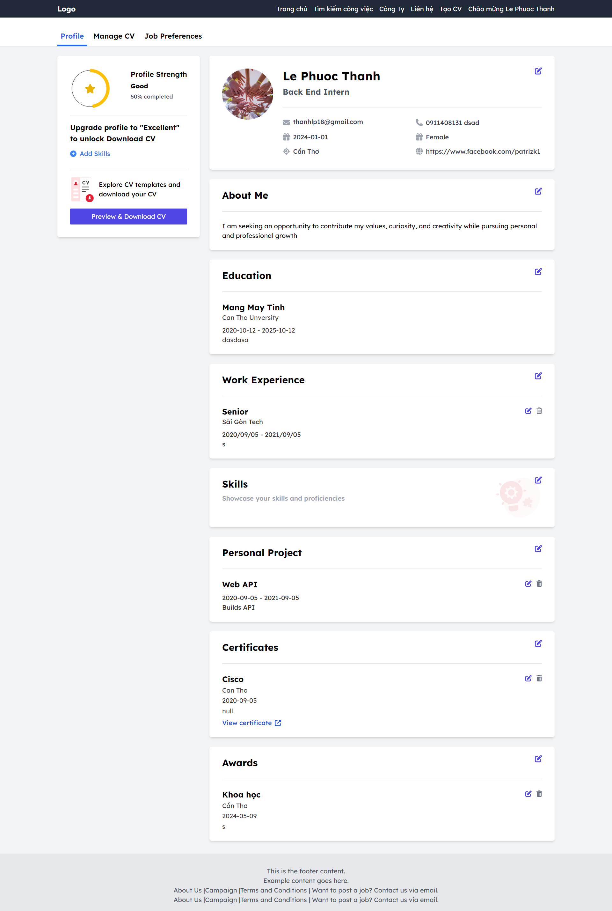
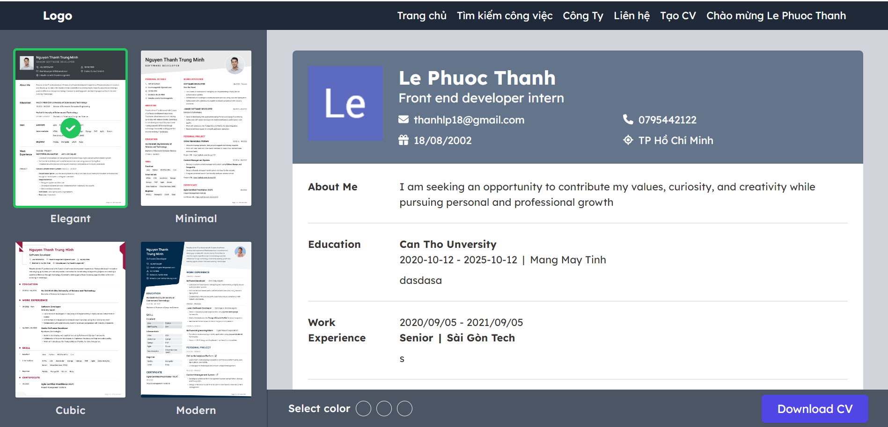

# Project Name

School project jobs-seeking-website, using: react@typescript, react-router-dom, tailwind css

## Table of Contents

- [Library and Framework](#Library_and_Framework)
- [Features](#features)
- [Screens](#Screen)

## Library_and_Framework

1. React@typescript
2. React-router-dom
3. Redux tookit
4. Tailwind CSS
5. Axios

## Screens

1. Home screen: 
2. Login screen: 
3. Profile screen: 
4. CV screen: 
5. Job Setting screen: 
